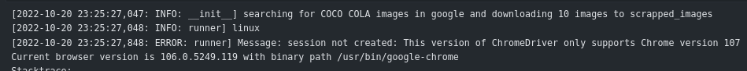

### install the scraper 
```bash
pip install image-scrapper-pk1308
```
### import lib 
```bash
from imagescrapper import google_scrapper
```

### run scrapper 
```bash
image_scrapper = google_scrapper(folder_path="scrapped_images", search_term="kitten", number_images=10)
```


## Excepted error 

 .


### Proposed solutions for the above error
```bash
!pip install chromedriver-py==106.0.5249.61 -q
```